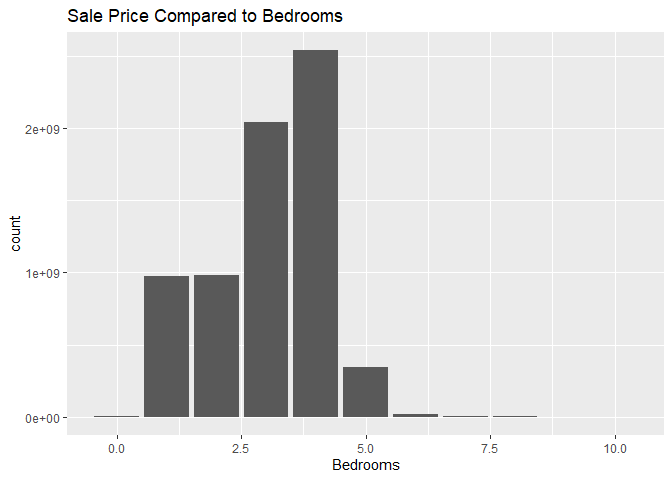
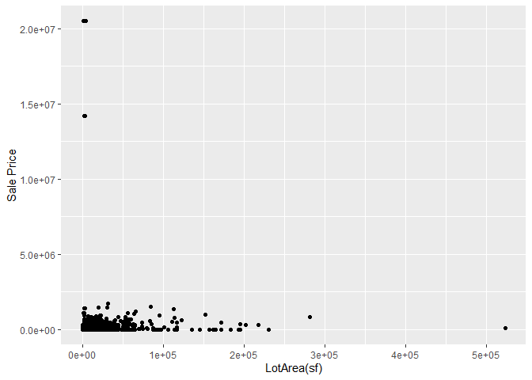

<!-- README.md is generated from README.Rmd. Please edit the README.Rmd file -->

# Lab report \#1

Follow the instructions posted at
<https://ds202-at-isu.github.io/labs.html> for the lab assignment. The
work is meant to be finished during the lab time, but you have time
until Monday evening to polish things.

Include your answers in this document (Rmd file). Make sure that it
knits properly (into the md file). Upload both the Rmd and the md file
to your repository.

All submissions to the github repo will be automatically uploaded for
grading once the due date is passed. Submit a link to your repository on
Canvas (only one submission per team) to signal to the instructors that
you are done with your submission.

## Question 1

``` r
library(classdata)
head(ames)
```

    ##    Parcel ID                       Address             Style
    ## 1 0903202160      1024 RIDGEWOOD AVE, AMES 1 1/2 Story Frame
    ## 2 0907428215 4503 TWAIN CIR UNIT 105, AMES     1 Story Frame
    ## 3 0909428070        2030 MCCARTHY RD, AMES     1 Story Frame
    ## 4 0923203160         3404 EMERALD DR, AMES     1 Story Frame
    ## 5 0520440010       4507 EVEREST  AVE, AMES              <NA>
    ## 6 0907275030       4512 HEMINGWAY DR, AMES     2 Story Frame
    ##                        Occupancy  Sale Date Sale Price Multi Sale YearBuilt
    ## 1 Single-Family / Owner Occupied 2022-08-12     181900       <NA>      1940
    ## 2                    Condominium 2022-08-04     127100       <NA>      2006
    ## 3 Single-Family / Owner Occupied 2022-08-15          0       <NA>      1951
    ## 4                      Townhouse 2022-08-09     245000       <NA>      1997
    ## 5                           <NA> 2022-08-03     449664       <NA>        NA
    ## 6 Single-Family / Owner Occupied 2022-08-16     368000       <NA>      1996
    ##   Acres TotalLivingArea (sf) Bedrooms FinishedBsmtArea (sf) LotArea(sf)  AC
    ## 1 0.109                 1030        2                    NA        4740 Yes
    ## 2 0.027                  771        1                    NA        1181 Yes
    ## 3 0.321                 1456        3                  1261       14000 Yes
    ## 4 0.103                 1289        4                   890        4500 Yes
    ## 5 0.287                   NA       NA                    NA       12493  No
    ## 6 0.494                 2223        4                    NA       21533 Yes
    ##   FirePlace              Neighborhood
    ## 1       Yes       (28) Res: Brookside
    ## 2        No    (55) Res: Dakota Ridge
    ## 3        No        (32) Res: Crawford
    ## 4        No        (31) Res: Mitchell
    ## 5        No (19) Res: North Ridge Hei
    ## 6       Yes   (37) Res: College Creek

``` r
tail(ames)
```

    ##       Parcel ID                    Address             Style
    ## 6930 0531453220    1305 ILLINOIS AVE, AMES     1 Story Frame
    ## 6931 0535403030      114 E O NEIL DR, AMES     1 Story Frame
    ## 6932 0909279060      2124 HUGHES AVE, AMES 1 1/2 Story Frame
    ## 6933 0906329150 5115 SPRINGBROOK CIR, AMES     1 Story Frame
    ## 6934 0916479120  3013 GREEN HILLS DR, AMES     1 Story Frame
    ## 6935 0905480180     3017 LINCOLN WAY, AMES     1 Story Frame
    ##                           Occupancy  Sale Date Sale Price Multi Sale YearBuilt
    ## 6930 Single-Family / Owner Occupied 2022-05-19     200000       <NA>      1980
    ## 6931 Single-Family / Owner Occupied 2022-05-13     233000       <NA>      1968
    ## 6932 Single-Family / Owner Occupied 2022-05-23     340000       <NA>      1923
    ## 6933 Single-Family / Owner Occupied 2022-05-06     412000       <NA>      2021
    ## 6934 Single-Family / Owner Occupied 2022-05-10          0       <NA>      2021
    ## 6935 Single-Family / Owner Occupied 2022-05-12     195000       <NA>      1957
    ##      Acres TotalLivingArea (sf) Bedrooms FinishedBsmtArea (sf) LotArea(sf)  AC
    ## 6930 0.247                  906        3                   820       10776 Yes
    ## 6931 0.191                  952        4                   784        8300 Yes
    ## 6932 0.288                 2156        5                    NA       12560  No
    ## 6933 0.484                 1474        3                    NA       21058 Yes
    ## 6934 0.270                 1915        3                    NA       11778 Yes
    ## 6935 0.208                 1340        3                    NA        9060 Yes
    ##      FirePlace            Neighborhood
    ## 6930        No   (36) Res: Sawyer West
    ## 6931        No        (27) Res: N Ames
    ## 6932        No      (32) Res: Crawford
    ## 6933       Yes (37) Res: College Creek
    ## 6934       Yes        (22) Res: Timber
    ## 6935       Yes       (34) Res: Edwards

``` r
library(ggplot2)
```

- Parcel id: character, Unique ID for each house, N/A
- address: character, address of each house, N/A
- style: character, what style type each house is, 1 story - 3 story
- occupancy: character, how the house is occupied, N/A
- sale date: numerical, date the house was sold, 1-1-2020 - 12-31-2022
- sale price: numerical, the price the house was sold at, 0-700,000
- muti-sale: character, wheather or not there was mutiple sales, N/A
- year built: numerical, year the house was built, 1920-2022
- acres: Numerical, how many acres the property has, 0-2 acres
- total living area:Numerical,the square footage of the inside of the
  home, 600-5000 sq ft
- bedrooms: numerical, how many bedrooms are in the home, 0-6 bedrooms
- finished basement area:Numerical, the square footage if the home has a
  finished basement, 600-200 sq ft
- lot area: Numerical, size of the property in square footage,
  2000-10000 sq ft
- A/C: Character, if the home has AC, yes or no
- fireplace: Character, if the home has a fireplace, yes or no
- neighborhood: Character, what neighborhood the home is in, different
  neighborhoods in Ames

## Question 2

We found the variable of interest to be Sale Price

## Question 3

``` r
library(ggplot2)
ggplot(ames, aes(x=Bedrooms))+
  geom_bar(aes(weight = `Sale Price`))+ 
  ggtitle("Sale Price Compared to Bedrooms")
```

    ## Warning: Removed 447 rows containing non-finite values (`stat_count()`).

<!-- -->

``` r
# Minimum Sale Price
min(ames$`Sale Price`, na.rm = TRUE)
```

    ## [1] 0

``` r
# Maximum Sale Price
max(ames$`Sale Price`, na.rm = TRUE)
```

    ## [1] 20500000

#### The minimum for the value of Sale Price is 0 and the maximum is 20,500,000. The general pattern between the Sale Price and the number of bedrooms is as the number of bedrooms increase so does the Sale Price. There is an odd part of the data that starts at five bedrooms or more, it does not seem to follow this pattern as the Sale Price seems to go down.

## Question 4

### Allison’s work:

### Kelly’s work:

``` r
ggplot(ames, aes(x=`LotArea(sf)`, y=`Sale Price`))+
  geom_point(alpha=0.6, color="purple")+ labs( title = "Relationship between Sale Price and Lot Area", x="Lot Area", y="Sale Price") +
  geom_smooth(method = "lm", color = "red", se = FALSE) +
  coord_cartesian(xlim = c(0, 45000), ylim = c(0, 1500000)) +
  theme_minimal()
```

    ## `geom_smooth()` using formula = 'y ~ x'

    ## Warning: Removed 89 rows containing non-finite values (`stat_smooth()`).

    ## Warning: Removed 89 rows containing missing values (`geom_point()`).

<!-- -->

``` r
# Minimum LotArea(sf)
min(ames$`LotArea(sf)`, na.rm = TRUE)
```

    ## [1] 0

``` r
# Maximum LotArea(sf)
max(ames$`LotArea(sf)`, na.rm = TRUE)
```

    ## [1] 523228

#### The range of the chosen variable, lot area, is 0-523228. The scatterplot shows that as Lot Area increases, Sales Price decreases. This seems to be counter intuitive but there are a lot of factors that impact Sales Price as location. Large lots in rural area are less than large areas in urban areas. This kind of follows the pattern in the previous graph after 5 bedrooms.

### Kenzie’s work:

### Marcus’s work:
